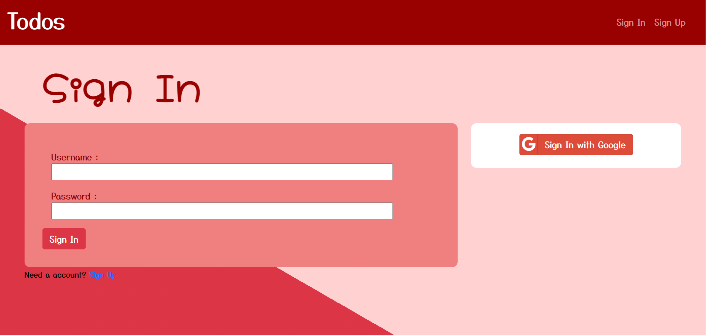
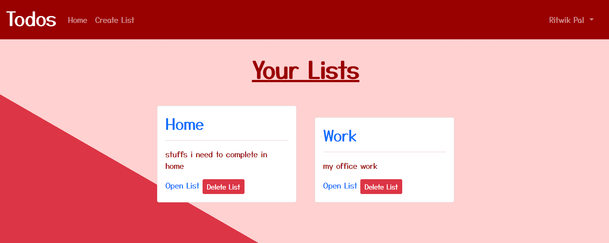
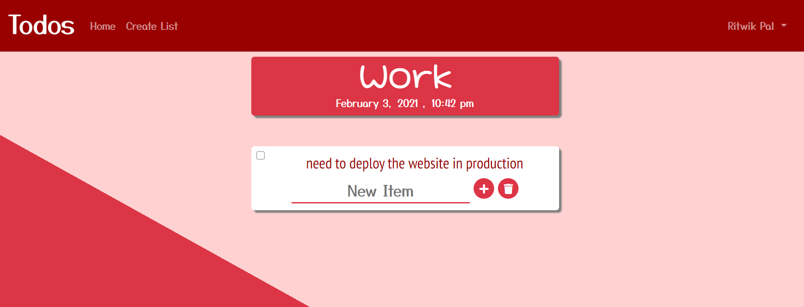

# Todos

## Organise your items under various lists :

-   Lets you add➕ and delete❌ various items in your categorised lists
-   Delete the whole list in one go, when all the items are completed

## Development Sights :

This project uses MongoDB as database storage. Local authentication facility is developed using Passport.js and any password is hashed before storing to database using bcrypt . Users can also sign in using Google account , which is also set up using Passport.js

Few enviroment variables which needs to set up before development or deploying to production.

```
NODE_ENV= development
MONGO_USERNAME = *your_username*
MONGO_PASSWORD = *your_password*
SESSION_SECRET = *"your_session_secret"*
SALT_ROUNDS = *salt_rounds_for_bcrypt*

GOOGLE_CLIENT_ID = *your_google_client_id*
GOOGLE_CLIENT_SECRET = *your_googleclient_secret*

```

## Here are some screenshots of how the website can be used :





### Live link at:

[Todos](https://todos-by-ritwik.herokuapp.com/)
